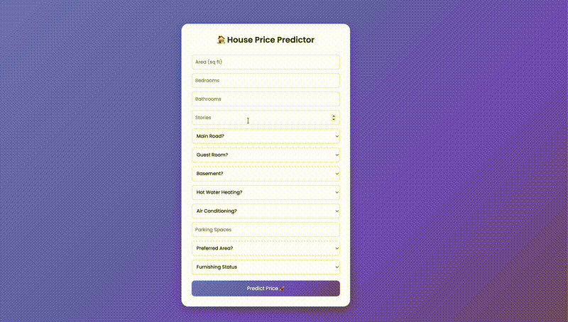

# 🏠 Production ML Pipeline - House Price Prediction

A **production-ready end-to-end Machine Learning pipeline** for predicting house prices, built with modern **MLOps practices** including CI, MLflow tracking, Docker, and a Flask-based web interface.

---

## 🚀 Features

* 🔄 End-to-End ML Pipeline (Data → Training → Evaluation → Deployment)
* ⚙️ Config-driven architecture using YAML
* 📊 MLflow experiment tracking & model logging
* 📈 Automated metrics & visualization generation
* 🐳 Dockerized application (production-ready)
* 🔁 CI pipeline using GitHub Actions
* 🌐 Interactive Web UI for predictions
* 🧾 Structured logging system

---

## 🚀 Quick Start

```bash
# Clone & install
git clone https://github.com/noumanhafeez/production-ml-pipeline-house-prediction.git
cd production-ml-pipeline-house-prediction

pip install -r requirements.txt

# Train model
python main.py

# Launch web app  
python app.py
```
---

## 🌐 Web UI Preview
A simple and interactive UI where users can input house features and get price predictions instantly.

## 🎥 Demo



## 🌐 Live Demo
> 🚧 Live demo coming soon (deployment in progress)
---

## 📂 Project Structure

```
production-ml-pipeline-house-prediction/
│
├── .github/workflows/        # CI pipeline
├── artifacts/                # Saved models & outputs
├── assets/                   # assets (media files)
├── data/                     # Dataset
├── logs/                     # Log files
├── mlruns/                   # MLflow experiments
├── models/                   # Training logic
│   └── train.py
├── notebook/                 # EDA notebooks
├── src/                      # Core source code
│   ├── config.py
│   ├── data_loader.py
│   ├── data_splitter.py
│   ├── data_preprocessing.py
│   ├── pipeline.py
│   ├── report.py
│   ├── get_prediction.py
│   └── utils/logger.py
├── templates/                # HTML templates
├── app.py                    # Flask web app
├── main.py                   # Training entry point
├── config.yaml               # Configuration file
├── Dockerfile                # Container configuration
├── requirements.txt
└── README.md
```

---

## ⚙️ Configuration

All parameters are controlled via `config.yaml`.

### Example:

```yaml
data:
  path: data/housing.csv
  target_column: price
  test_size: 0.2
  random_state: 42

model:
  name: random_forest

  params:
    random_forest:
      n_estimators: 100
      max_depth: 40
```

- ✔ Easily switch models
- ✔ Adjust hyperparameters
- ✔ Maintain reproducibility

---

## 📋 Dataset

**Housing Prices Dataset**
- **Source**: [Kaggle - Housing Prices Dataset](https://www.kaggle.com/datasets/yasserh/housing-prices-dataset)
- **Size**: 545 houses
- **Features**: 12 (area, bedrooms, bathrooms, stories, mainroad, guestroom, basement, hotwaterheating, airconditioning, parking, prefarea, furnishingstatus)
- **Target**: `price` (house price in currency units)
- **Location**: `data/housing.csv` (included in repo)

**Key Stats**:
- **Numerical**: 6 features (price, area, bedrooms, bathrooms, stories, parking)
- **Categorical**: 7 features (mainroad, guestroom, basement, hotwaterheating, airconditioning, prefarea, furnishingstatus)
> **Note**: This is a small dataset for demo purposes. The pipeline is **fully scalable** for production datasets (millions of rows) with the same config-driven MLOps architecture.
---

## 🧠 ML Pipeline Workflow

1. Load dataset
2. Split data into train/test
3. Create preprocessing + model pipeline
4. Train model
5. Generate predictions
6. Evaluate performance (R², MAE, RMSE)
7. Log everything with MLflow
8. Save trained model

---

## 📊 MLflow Tracking

Run MLflow UI locally:

```bash
mlflow ui
```

Then open:

```
http://localhost:5000
```

### Tracks:

* Parameters
* Metrics
* Models
* Artifacts (plots, files)

---

## ▶️ Run Training Pipeline

```bash
python main.py
```

---

## 🌐 Run Web Application

```bash
python app.py
```

Open in browser:

```
http://localhost:5000
```

---

## 🐳 Run with Docker

### Build Docker Image

```bash
docker build -t house-price-app .
```

### Run Container

```bash
docker run -p 5000:5000 house-price-app
```

---

## 🔁 Continuous Integration (CI)

GitHub Actions automatically:
- Installs dependencies
- Runs training pipeline
- Validates pipeline execution
- Prevents broken commits from merging
Workflow file:

```
.github/workflows/ci.yaml
```

---

## 📈 Outputs

After training, the following are generated:

* 📦 Model files → `artifacts/*.pkl`
* 📊 Metrics → `metrics.csv`
* 📉 Visualization → `prediction.png`

---

## 💡 Why This Project?

This project demonstrates how to take a machine learning model from experimentation to a production-ready system using MLOps best practices.

--- 

## ⚠️ Future Improvements

* 🚀 Add CD pipeline (auto deployment)
* 🔐 Add input validation & error handling
* 🌍 Deploy on cloud (Render / AWS / HuggingFace)
* 🧪 Add unit & integration tests
* 🎨 Improve UI/UX design
* 🔄 Model versioning strategy (staging/production)
* 📊 Add monitoring (data drift, model drift)
* ⚡ Convert Flask → FastAPI for production APIs

---

## 🛠️ Tech Stack

- **Language**: Python
- **ML**: Scikit-learn
- **MLOps**: MLflow, Docker, GitHub Actions
- **Backend**: Flask
- **Frontend**: HTML, CSS
- **Others**: YAML, Logging

---

## 📜 License

MIT License © 2026 Nouman Hafeez

---

## 👨‍💻 Author

**Nouman Hafeez**
Machine Learning Engineer | MLOps Enthusiast

📫 Connect: https://www.linkedin.com/in/nouman-hafeez/

---


---

## ⭐ Support

If you like this project, consider giving it a ⭐ on GitHub!
